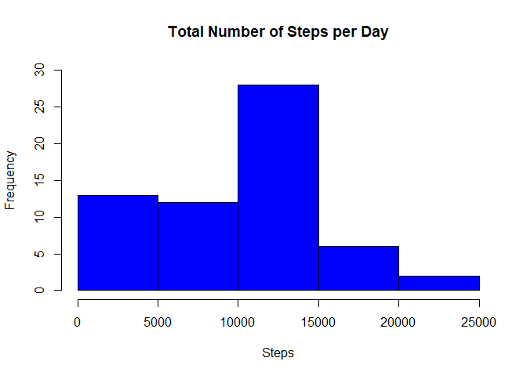
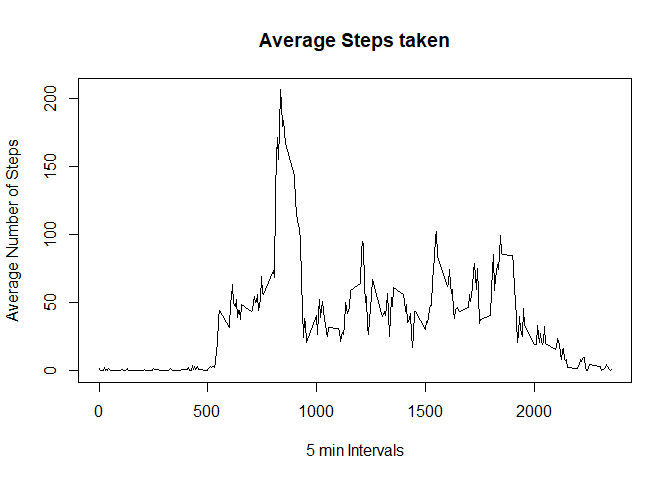
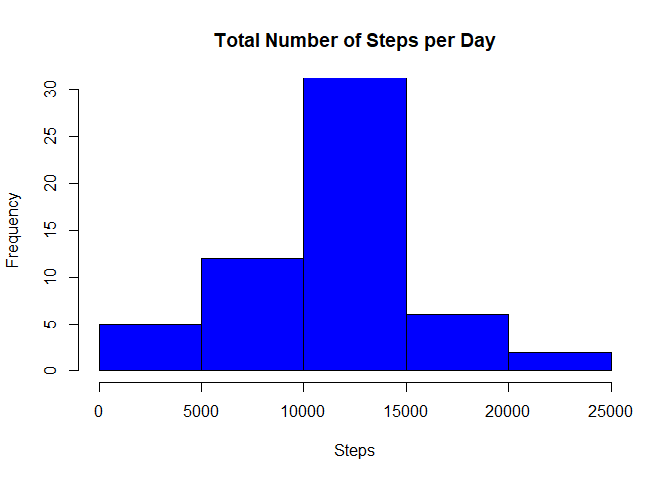
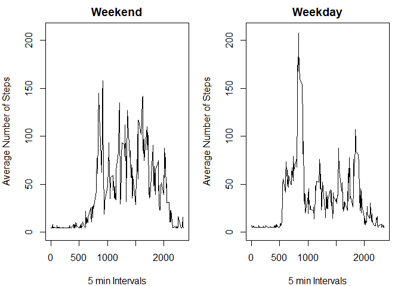

## Loading the data

Reading the data that has been downloaded to the working directory. 
Then edit the Date column into the correct format.


```r
library(readr)
data <- read_csv("./activity.csv",)
```

```
## Parsed with column specification:
## cols(
##   steps = col_double(),
##   date = col_date(format = ""),
##   interval = col_double()
## )
```

```r
data[,2]<-as.Date(data$date)
```

## Daily mean number of steps taken

Create a histogram using the following script

```r
steps<-with(data,tapply(steps,date,sum,na.rm=TRUE))
hist(steps,col="blue",xlab="Steps",ylab="Frequency",main="Total Number of Steps per Day",ylim=c(0,30))
```

<!-- -->

Now calculate the mean and median steps taken each day.


```r
print(steps_mean<-mean(steps))
```

```
## [1] 9354.23
```

```r
print(steps_median<-median(steps))
```

```
## [1] 10395
```

The mean number of steps is 9354.2295082 and the median is 10395.

## Calculating the average daily activity

Create a line graph showing the average number of steps taken throughout the trial.


```r
avg_steps<-with(data,tapply(steps,interval,mean,na.rm=TRUE))
intervals<-unique(data$interval)
new<-data.frame(cbind(avg_steps,intervals))
plot(new$intervals,new$avg_steps,type="l",xlab="5 min Intervals",ylab="Average Number of Steps",main="Average Steps taken")
```

<!-- -->

Calculate the period of highest activity.


```r
index<-which.max(new$avg_steps)
max<-new[index,2]
```

The period of highest activity is 835.

## Imputing missing values

Firstly how many NAs are in the data


```r
sum(is.na(data$steps))
```

```
## [1] 2304
```

Quite a lot!

Then create a new dataset that has these removed


```r
index<-which(is.na(data$steps))
l<-length(index)
avg_steps<-with(data,tapply(steps,date,mean,na.rm=TRUE))
na<-mean(avg_steps,na.rm=TRUE)
for(i in 1:l){
        data[index[i],1]<-na
}
```

Have we succesfully removed the NAs?


```r
sum(is.na(data$steps))
```

```
## [1] 0
```

There are no longer any NAs in the dataset.

Now we can repeat the process above with the new data set.

```r
steps<-with(data,tapply(steps,date,sum,na.rm=TRUE))
hist(steps,col="blue",xlab="Steps",ylab="Frequency",main="Total Number of Steps per Day",ylim=c(0,30))
```

<!-- -->

Once again calculate the mean and median steps taken each day.


```r
print(steps_mean<-mean(steps))
```

```
## [1] 10766.19
```

```r
print(steps_median<-median(steps))
```

```
## [1] 10766.19
```

The mean number of steps is 10766.19 and the median is 10766.19. We can now see that these are the same.

## How does Activity chage between Weekdays and Weekends?

Firstly we will need to load the dplyr package.


```r
library(dplyr)
```

```
## 
## Attaching package: 'dplyr'
```

```
## The following objects are masked from 'package:stats':
## 
##     filter, lag
```

```
## The following objects are masked from 'package:base':
## 
##     intersect, setdiff, setequal, union
```

Now we need to create a new variable called day.


```r
data_mod<- mutate(data, day = ifelse(weekdays(data$date) == "Saturday" | weekdays(data$date) == "Sunday", "weekend", "weekday"))
data_mod$day<-as.factor(data_mod$day)
str(data_mod)
```

```
## Classes 'spec_tbl_df', 'tbl_df', 'tbl' and 'data.frame':	17568 obs. of  4 variables:
##  $ steps   : num  37.4 37.4 37.4 37.4 37.4 ...
##  $ date    : Date, format: "2012-10-01" "2012-10-01" ...
##  $ interval: num  0 5 10 15 20 25 30 35 40 45 ...
##  $ day     : Factor w/ 2 levels "weekday","weekend": 1 1 1 1 1 1 1 1 1 1 ...
```

Finally lets assess the differences between Weekday activity and Weekend activity


```r
act_wknd<-subset(data_mod,as.character(data_mod$day)=="weekend")
act_wkdy<-subset(data_mod,as.character(data_mod$day)=="weekday")
steps_wknd<-with(act_wknd,tapply(steps,interval,mean,na.rm=TRUE))
steps_wkdy<-with(act_wkdy,tapply(steps,interval,mean,na.rm=TRUE))
int_wknd<-unique(act_wknd$interval)
int_wkdy<-unique(act_wkdy$interval)
new_wknd<-data.frame(cbind(steps_wknd,int_wknd))
new_wkdy<-data.frame(cbind(steps_wkdy,int_wkdy))
par(mfrow=c(1,2),mar=c(4,4,2,1))
plot(new_wknd$int_wknd,new_wknd$steps_wknd,type = "l",xlab = "5 min Intervals",
     ylab = "Average Number of Steps",main = "Weekend",ylim=c(0,210))
plot(new_wkdy$int_wkdy,new_wkdy$steps_wkdy,type = "l",xlab = "5 min Intervals",
     ylab = "Average Number of Steps",main = "Weekday",ylim=c(0,210))
```

<!-- -->

Here we can see that there is a more constant level of activity during the Weekends, after a later start to activity.
However the largest spike of activity occurs early during Weekdays.
